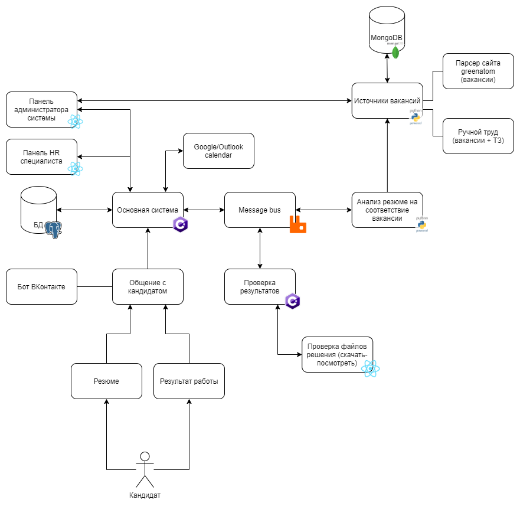

# OuchR

Проект, позволяющий автоматизировать работу HR специалистов, организуя общение кандидатов через бота ВКонтакте.

## Как запустить сервис локально для разработки

### Необходимо
* Docker

1. Создать файл `.env`, указать в нем два обязательный параметра
   * VK_ACCESS_TOKEN=токен доступа от группы ВКонтакте ([документация](https://vk.com/dev/bizmessages_doc))
     * Необхолимое право для токена - сообщения сообщества
     * В сообществе необходимо включить Long Pull API с версией **5.131**, в типах событий включить **Входящие сообщения**
     * В настройках сообщества, в Сообщениях, необходимо включить **Возможности ботов**
   * VK_GROUP_ID=ID группы ВКонтакте ([например - 171158291 для RTUITLab](https://vk.com/dev/groups.getById?params[group_ids]=rtuitlab&params[v]=5.21))
2. Собрать код командой `docker-compose build`
3. Запустить сервисы командой `docker-compose up`
4. При успешном запуске сервисов сайт системы будет доступен по адресу [127.0.0.1](http://127.0.0.1)

Текущая архитектура представлена на следующей диаграмме:

Состояние реализации архитектуры на данный момент (18.082021)

| Сервис                                  | Репозиторий                                                    | Развернуто | CI   |
| --------------------------------------- | -------------------------------------------------------------- | ---------- | ---- |
| Панель пользователя/администратора      | [OuchR-Site](https://github.com/RTUITLab/OuchR-Site)           | ✔Да        | ❌Нет |
| Основная система                        | [OuchR-Bot](https://github.com/RTUITLab/OuchR-Bot)             | ✔Да        | ❌Нет |
| Источники вакансий                      | ❌Нет                                                           | ❌Нет       | ❌Нет |
| Анализ резюме на соответствие вакансиям | [OuchR-PdfParser](https://github.com/RTUITLab/OuchR-PdfParser) | ❌Нет       | ❌Нет |
| Проверка результатов                    | ❌Нет                                                           | ❌Нет       | ❌Нет |
| Message bus                             | -                                                              | ❌Нет       | -    |
| Proxy (техническая особенность)         | [OuchR](https://github.com/RTUITLab/OuchR)                     | ✔Да        | ❌Нет |
